# Bankify | Horizon

A platform that connects to multiple bank accounts, displays transactions in Realtime and even allows you to transfer money to other platform users with an ultra secure SSR Authentication, A Home page showcasing Bank balance, connected credit card accounts, transaction list and spending
A page where we can see all connected banks and transactions history.
It also contains a payment transfer page where we can make transfers to other accounts on the platform.

## Folder Structure
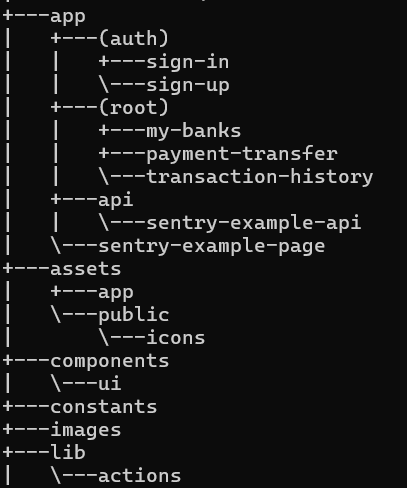

## Tech Stack 

- HTML
- Tailwind CSS, Char.js, Shad-cn for UI
- TypeScript
- Nextjs
    - Server Side Rendering
    - Group routes
    - Nested Layouts
    - Server Actions
- Nodejs
- Appwrite : 
    - An open-source backend server that simplifies the process of building and managing web and mobile applications

    - Offers a variety of features such as user authentication, database management, file storage, and more
    -  Provides a user-friendly interface and comprehensive documentation for easy integration and development
    - Supports multiple programming languages and frameworks, making it versatile and accessible to developers
    - Has a strong community and active support channels for troubleshooting and assistance

- Dwolla : 
    - An online payment platform that allows users to send, receive, and request money
    - Offers a secure and reliable way to transfer funds
    - Integrates with various banks and financial institutions
       Provides a user-friendly interface for managing transactions
- Plaid : For payments (it works for payments for no matter where you are in the world). It is            a stripe alternative used by a well known financial giant Robin Hood. We are only               using the test mode for the application.
      - Plaid is all about connecting app with bank accounts, making it easy to access info and         do things like verify identity. It is like a middle man making it easy for the apps and         banks to share information securly.
      - 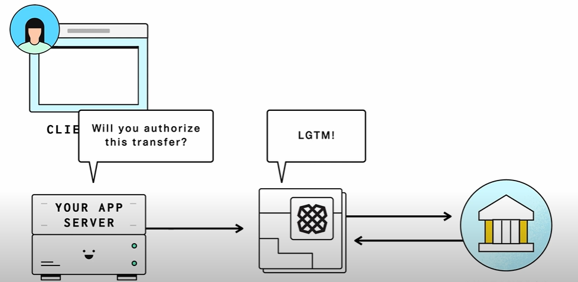
    

- Sentry : 
    - error monitoring software
    - helps every developer diagnose, fix, and optimize the performance of their code
    - Help people and businesses send, receive and request payments. Specializing in real time        payments. It facilitates actual money transfers. We have integrated Dwolla for payment          processing in the application. We have used the Dwolla sandbox.

## Screenshots

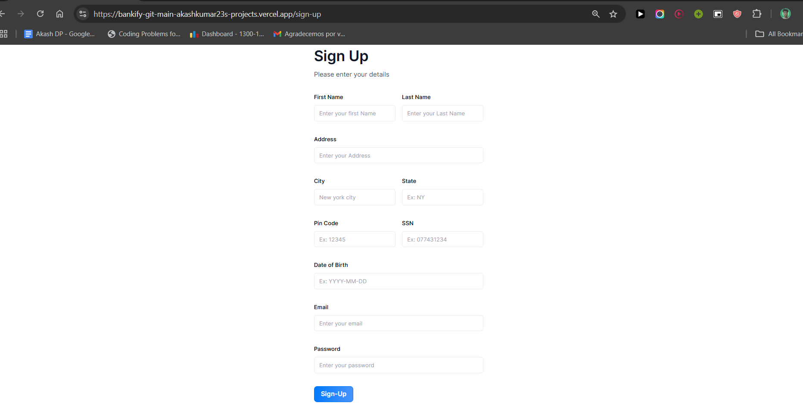

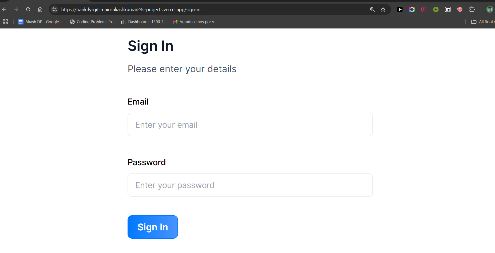

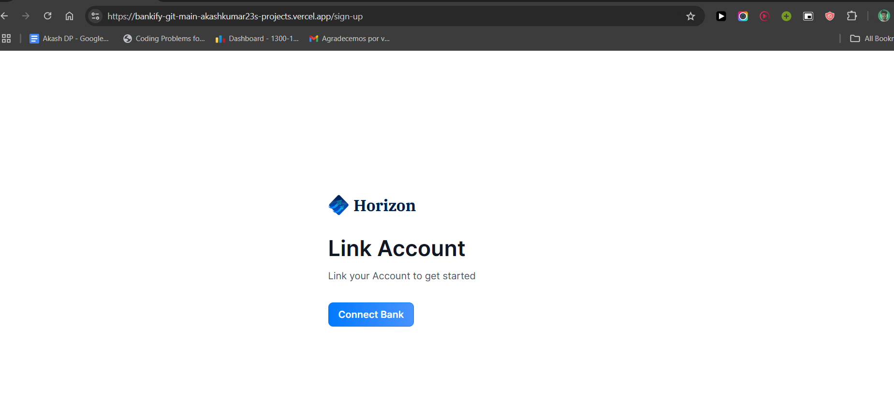

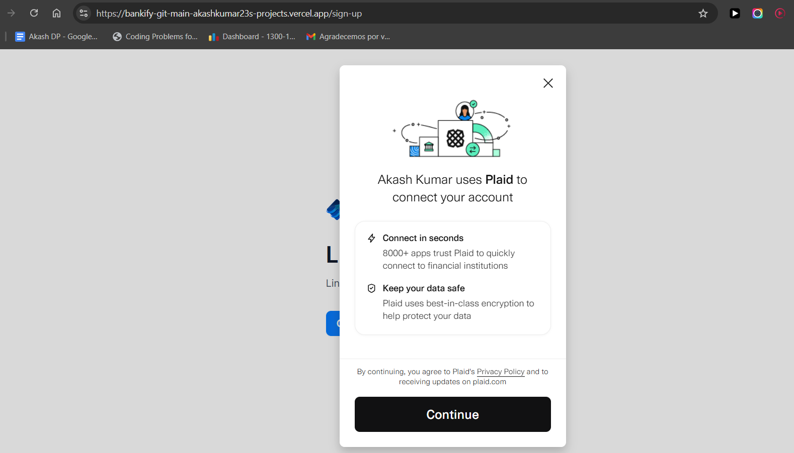

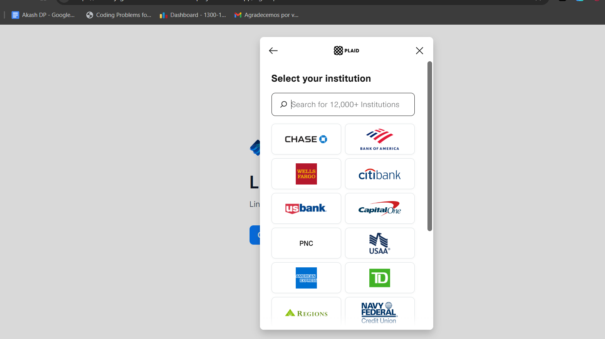

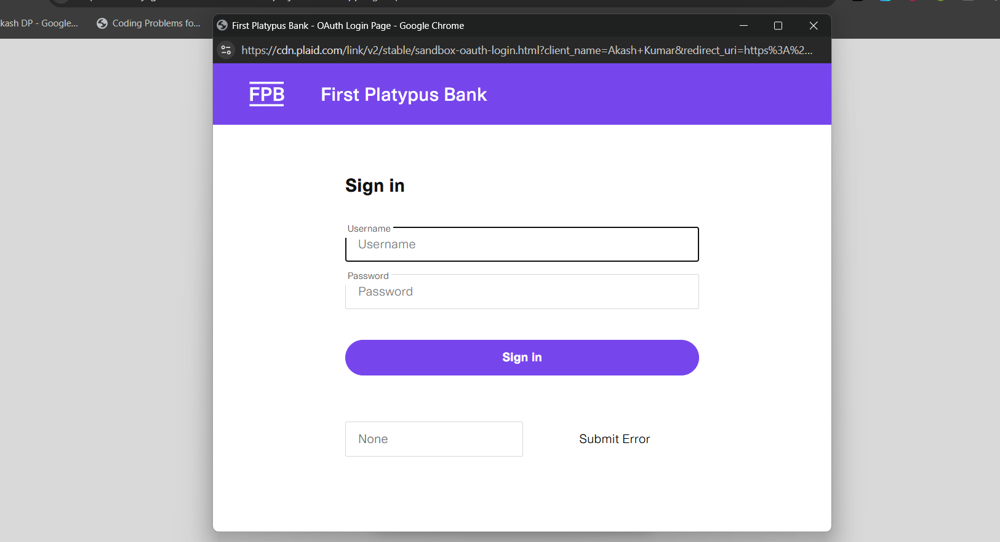

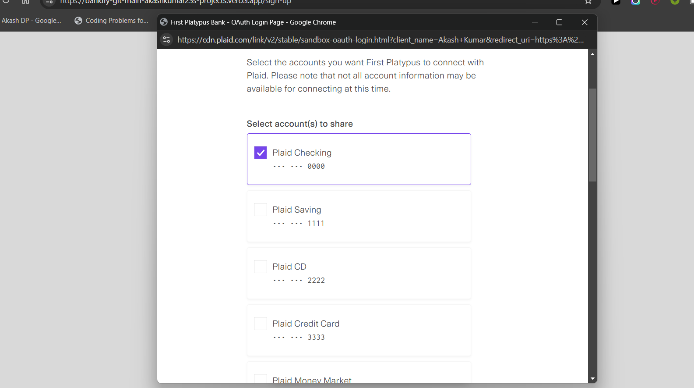

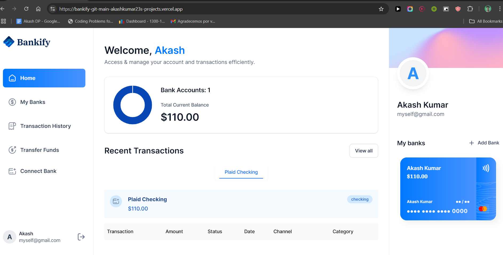

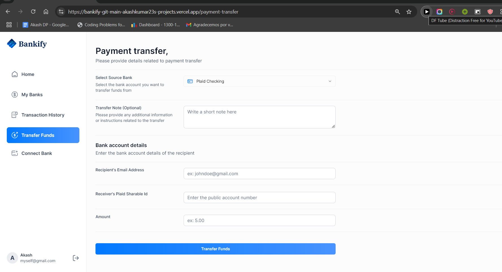

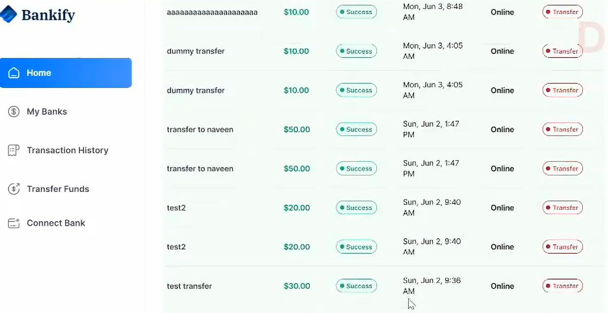

