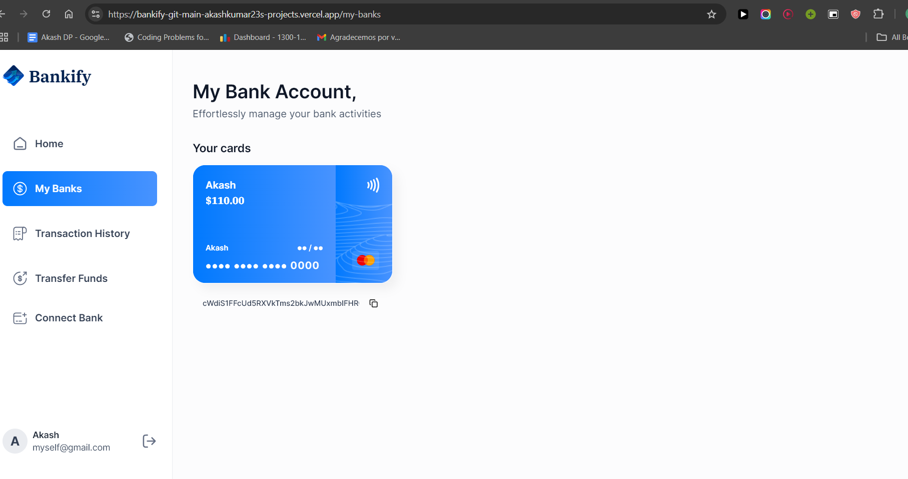

# Bankify | Horizon

An online banking Saas Application built using Next.js for server-side rendering, integrating Plaid APIs and used Dwolla for secure account linking, transaction history tracking, and fund transfers. 

Tech stack: HTML, TailwindCSS, TypeScript, JavaScript, React.js,
Node.js, and Appwrite (BaaS), Plaid, Dwolla.

## Tech Stack 

- HTML
- Tailwind CSS
- TypeScript
- JavaScript
- Nodejs
- Appwrite : 
    - An open-source backend server that simplifies the process of building and managing web and mobile applications

    - Offers a variety of features such as user authentication, database management, file storage, and more
    -  Provides a user-friendly interface and comprehensive documentation for easy integration and development
    - Supports multiple programming languages and frameworks, making it versatile and accessible to developers
    - Has a strong community and active support channels for troubleshooting and assistance

- Dwolla : 
    - An online payment platform that allows users to send, receive, and request money
    - Offers a secure and reliable way to transfer funds
    - Integrates with various banks and financial institutions
       Provides a user-friendly interface for managing transactions
- Plaid :
    - Securely connect bank accounts to third-party applications
    - Simplify the process of accessing and using financial data
    - Enable real-time transaction data and balance updates
    - Provide a seamless user experience for managing finances
    - Offer a wide range of financial services and features

- Sentry : 
    - error monitoring software
    - helps every developer diagnose, fix, and optimize the performance of their code

## Screenshots

